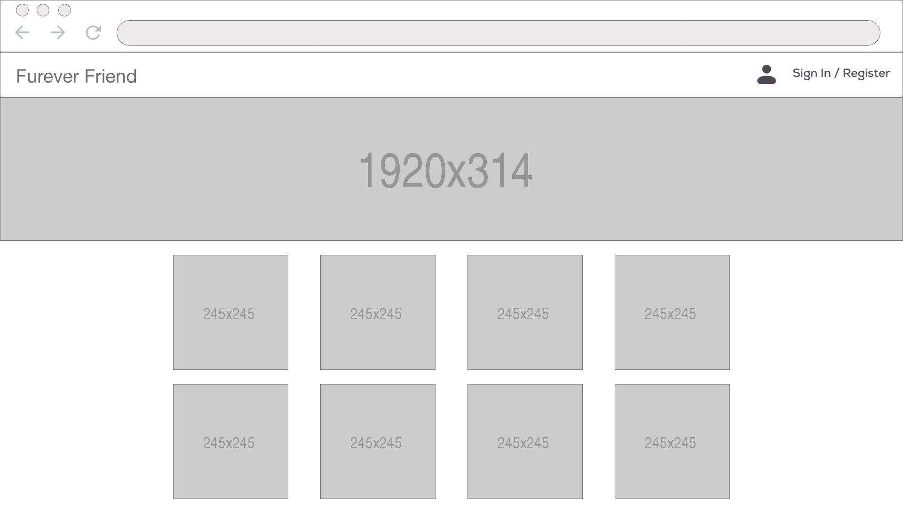
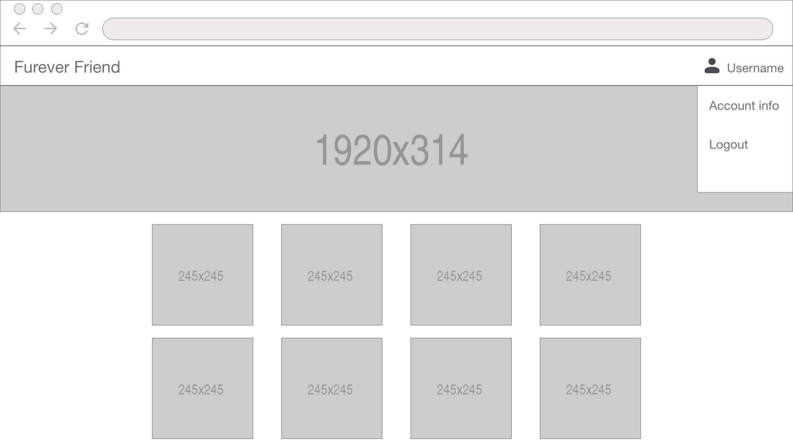
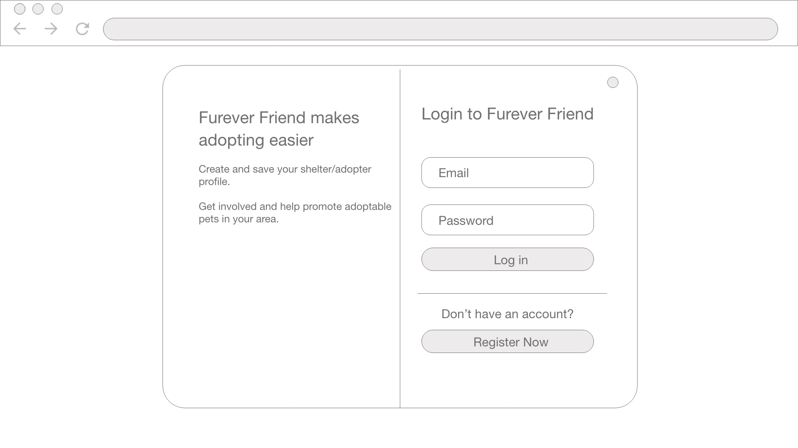
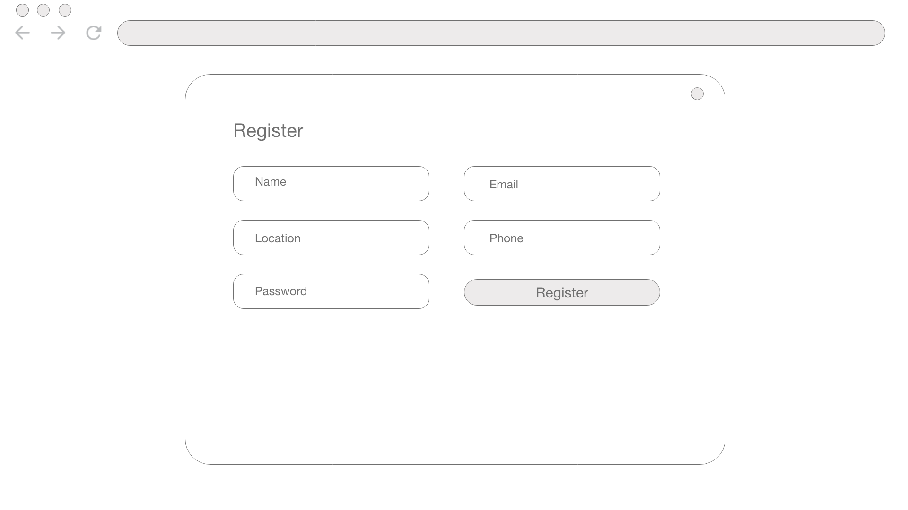
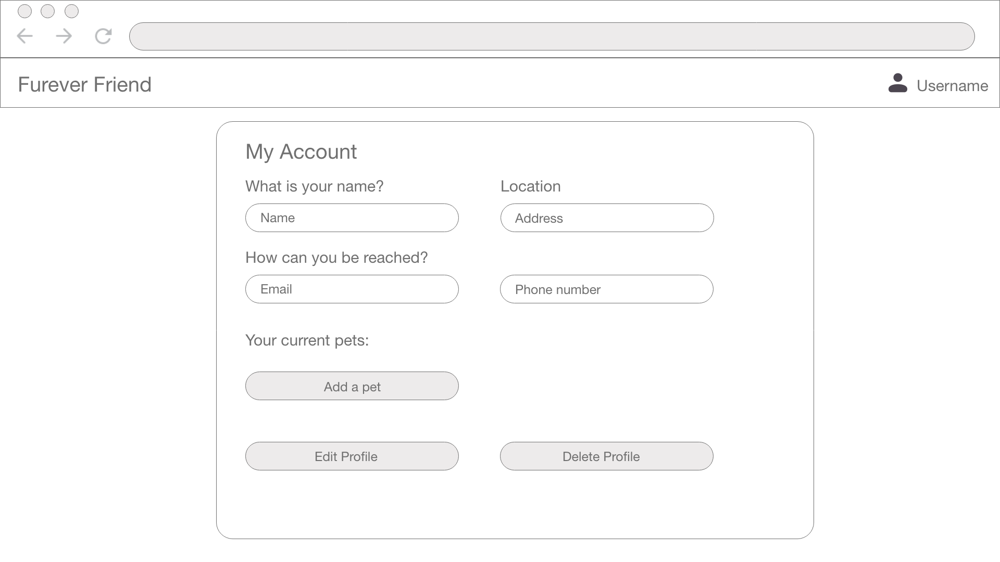
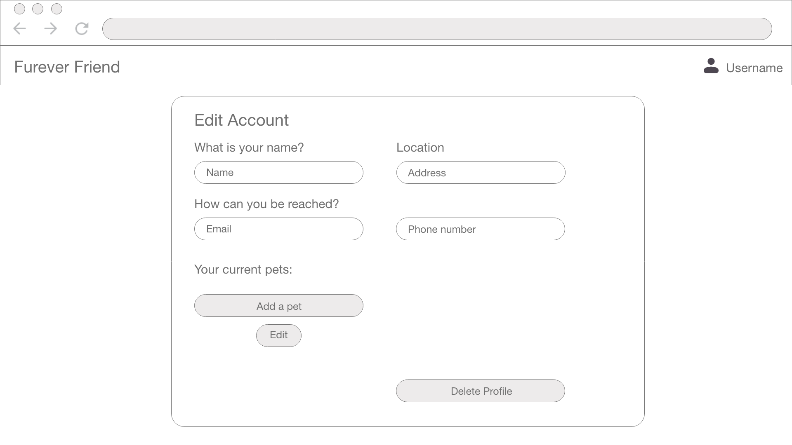

# Furever Friend - Adoption Site

### Intro
_______________________________________________________________________________________________________________________

Furever Friend is a website where shelters/caretakers can login and post available adoptees for adoption and prospective adopters can browse for a new family member!

### Intended User Flow
_______________________________________________________________________________________________________________________
The Furever Friend landing page serves as a new user's introduction to all of the currently available adoptee's on the site; it also functions to highlight the benefits of registering with the site.  Although users do not need to be registered with the site to view the individual adoptee pages, they do need to be registered/logged-in to post an adoptee.  Once logged in (or registered) users will be able to click on "Account Details" from the user icon in the navigation bar which will load a new page listing all user account details including the option to post an adoptee.  If they choose to post an adoptee, the user will be brought to a new page which allows them to input all relevant information regarding their adoptee - including a picture.  At any time thereafter, the user is able to edit all the key metrics for the adoptee.  Once that specific adoptee has found its new Furever Friend, the user will be able to delete them from their list of available adoptions; ultimately removing them from the landing page.  Should the user no longer have adoptees in their profile, they can permanently delete their account from the site.

### Initial Wireframe
_______________________________________________________________________________________________________________________

### Technologies Used
_______________________________________________________________________________________________________________________

* HTML5
* Javascript
* CSS
* HTML
* Express
* NodeJS
* MongoDB
* Mongoose
* Google Fonts
* Materialize
* GitHub
* Bcrypt
* Heroku

### Visit the site!
_______________________________________________________________________________________________________________________
[Screenshot] 

Visit the project page [here](https://furever-friends.herokuapp.com/dog)

### Next Steps
_______________________________________________________________________________________________________________________

* Implement saved dog list for potential adopters
* Implement search function

